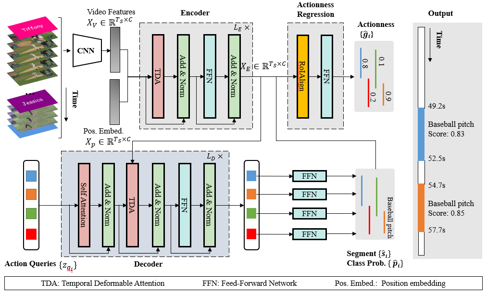

# TadTR: End-to-end Temporal Action Detection with Transformer

[](https://paperswithcode.com/sota/temporal-action-localization-on-thumos14?p=end-to-end-temporal-action-detection-with)

By [Xiaolong Liu](https://github.com/xlliu7), [Qimeng Wang](https://scholar.google.com/citations?user=hi7AeE8AAAAJ), [Yao Hu](https://scholar.google.com/citations?user=LIu7k7wAAAAJ), [Xu Tang](https://scholar.google.com/citations?user=grP24aAAAAAJ), [Shiwei Zhang](https://scholar.google.com/citations?user=ZO3OQ-8AAAAJ), [Song Bai](http://songbai.site), [Xiang Bai](https://scholar.google.com/citations?user=UeltiQ4AAAAJ).

This repo holds the code for TadTR, described in the technical report:
[End-to-end temporal action detection with Transformer](https://arxiv.org/abs/2106.10271).

<!-- _The tech report is out-dated. We have significantly improved TadTR since we uploaded it to arxiv. It achives much better performance now. We'll update the arxiv version recently._  -->

We have also explored fully end-to-end training from RGB images with TadTR. See our CVPR 2022 work [E2E-TAD][e2e-tad].


## Introduction

TadTR is an end-to-end Temporal Action Detection TRansformer. It has the following advantages over previous methods:
- Simple. It adopts a set-prediction pipeline and achieves TAD with a *single network*. It does not require a separate proposal generation stage.
- Flexible. It removes hand-crafted design such as anchor setting and NMS.
- Sparse. It produces very sparse detections (e.g. 10 on ActivityNet), thus requiring lower computation cost.
- Strong. As a *self-contained* temporal action detector, TadTR achieves state-of-the-art performance on HACS and THUMOS14. It is also much stronger than concurrent Transformer-based methods such as **RTD-Net** and **AGT**.



## Updates
[2022.8.7] Add support for training/testing on THUMOS14!

[2022.7.4] Glad to share that this paper will appear in IEEE Transactions on Image Processing (TIP). Although I am still busy with my thesis, I will try to make the code accessible soon. Thanks for your patience.

[2022.6] Update the technical report of this work on arxiv (now v3).

[2022.3] Our new work [E2E-TAD][e2e-tad] based on TadTR is accepted to CVPR 2022. It supports fully end-to-end training from RGB images.

[2021.9.15] Update the performance on THUMOS14.

[2021.9.1] Add demo code.

[2021.7] Our revised paper was submitted to IEEE Transactions on Image Processing.

[2021.6] Our revised paper was uploaded to arxiv.

[2021.1.21] Our paper was submitted to IJCAI 2021. 

## TODOs
- [x] add model code
- [x] add inference code
- [x] add training code
- [ ] support training/inference with video input

## Main Results
- HACS Segments

|Method|Feature|mAP@0.5|mAP@0.75|mAP@0.95|Avg. mAP|
| :----: |:----: | :--: | :----: | :---: | :----: |
|TadTR|I3D RGB|47.14 |32.11 |10.94| 32.09|


- THUMOS14

|Method|Feature|mAP@0.3|mAP@0.4|mAP@0.5|mAP@0.6|mAP@0.7|Avg. mAP|
| :----: |:----: | :--: | :----: | :---: | :----: |:----: | :----: |
|TadTR|I3D 2stream|74.8 |69.1| 60.1| 46.6| 32.8| 56.7|

- ActivityNet-1.3

|Method|Feature|mAP@0.5|mAP@0.75|mAP@0.95|Avg. mAP|
| :----: |:----: | :--: | :----: | :---: | :----: |
|TadTR|TSN 2stream|51.29 |34.99| 9.49| 34.64|
|TadTR|TSP|53.62| 37.52| 10.56| 36.75|


## Install
### Requirements

* Linux or Windows
  
* Python>=3.7

* (Optional) CUDA>=9.2, GCC>=5.4
  
* PyTorch>=1.5.1, torchvision>=0.6.1 (following instructions [here](https://pytorch.org/))
  
* Other requirements
    ```bash
    pip install -r requirements.txt
    ```
### Compiling CUDA extensions (Optional)
The RoIAlign operator is implemented with CUDA extension.
If your machine does have a NVIDIA GPU with CUDA support, you can run this step. Otherwise, please set `disable_cuda=True` in `opts.py`.
```bash
cd model/ops;

# If you have multiple installations of CUDA Toolkits, you'd better add a prefix
# CUDA_HOME=<your_cuda_toolkit_path> to specify the correct version. 
python setup.py build_ext --inplace
```

### Run a quick test
```
python demo.py
```

## 1.Data Preparation
Currently we only support `thumos14`.

### THUMOS14
Download all data from [[BaiduDrive(code: adTR)]](https://pan.baidu.com/s/183VprlbKNjMb3Gr-rfmROQ) or [[OneDrive]](https://husteducn-my.sharepoint.com/:f:/g/personal/liuxl_hust_edu_cn/EsMyXDlkrTdBsikoRQSIeUsBkxJJRsplbMyIQVYotiZRIQ?e=QYgiCH).

- Features: Download the I3D features `I3D_2stream_Pth.tar`. It was originally provided by the authors of P-GCN. I have concatenated the RGB and Flow features (drop the tail of the longer one if the lengths are inconsistent) and converted the data to float32 precision to save space.
- Annotations: The annotations of action instances and the meta information of feature files. Both are in JSON format (`th14_annotations_with_fps_duration.json` and `th14_i3d2s_ft_info.json`).
- Pre-trained Reference Models: Our pretrained model that use I3D features `thumos14_i3d2s_tadtr_reference.pth`. This model corresponds to the config file `configs/thumos14_i3d2s_tadtr.yml`.

After downloading is finished, extract the archived feature files inplace by `cd data;tar -xf I3D_2stream_Pth.tar`. Then put the features, annotations, the model under the `data/thumos14` directory. We expect the following structure in root folder.
```
- data
  - thumos14
    - I3D_2stream_Pth
     - xxxxx
     - xxxxx
    - th14_annotations_with_fps_duration.json
    - th14_i3d2s_ft_info.json
    - thumos14_tadtr_reference.pth
```


## 2.Test Pre-trained Models
Run
```
python main.py --cfg CFG_PATH --eval --resume CKPT_PATH
```
CFG_PATH is the path to the YAML-format config file that defines the experimental setting. For example, `configs/thumos14_i3d2s_tadtr.yml`. CKPT_PATH is the path of the pre-trained model. Alternatively, you can execute the Shell script `bash scripts/test_reference_models.sh thumos14` for simplity.


## 3.Training by Yourself
Run the following command
```
python main.py --cfg CFG_PATH
```

This codebase supports running on both CPU and GPU. 
- To run on CPU: please add ` --device cpu` to the above command. Also, you need to set `disable_cuda=True` in `opts.py`. The CPU mode does not support actionness regression and the detection performance is lower.
- To run on GPU: since the model is very lightweight, just one GPU is enough. You may specify the GPU device ID (e.g., 0) to use by the adding the prefix `CUDA_VISIBLE_DEVICES=ID ` before the above command. To run on multiple GPUs, please refer to `scripts/run_parallel.sh`.

During training, our code will automatically perform testing every N epochs (N is the `test_interval` in opts.py). Training takes 6~10 minutes on THUMOS14 if you use a modern GPU (e.g. TITAN Xp). You can also monitor the training process with Tensorboard (need to set `cfg.tensorboard=True` in `opts.py`). The tensorboard record and the checkpoint will be saved at `output_dir` (can be modified in config file).

After training is done, you can also test your trained model by running
```
python main.py --cfg CFG_PATH --eval
```
It will automatically use the best model checkpoint. If you want to manually specify the model checkpoint, run
```
python main.py --cfg CFG_PATH --eval --resume CKPT_PATH
```

Note that the performance of the model trained by your own may be different from the reference model, even though all seeds are fixed. The reason is that TadTR uses the `grid_sample` operator, whoses gradient computation involves the non-deterministic `AtomicAdd` operator. Please refer to [ref1](https://pytorch.org/docs/stable/notes/randomness.html) [ref2](https://pytorch.org/docs/stable/generated/torch.use_deterministic_algorithms.html#torch.use_deterministic_algorithms) [ref3(Chinese)](https://zhuanlan.zhihu.com/p/109166845) for details.

## Acknowledgement
The code is based on the [DETR](https://github.com/facebookresearch/detr) and [Deformable DETR](https://github.com/fundamentalvision/Deformable-DETR). We also borrow the implementation of the RoIAlign1D from [G-TAD](https://github.com/Frostinassiky/gtad). Thanks for their great works.

## Citing
```
@article{liu2022end,
  title={End-to-end Temporal Action Detection with Transformer},
  author={Liu, Xiaolong and Wang, Qimeng and Hu, Yao and Tang, Xu and Zhang, Shiwei and Bai, Song and Bai, Xiang},
  journal={IEEE Transactions on Image Processing (TIP)},
  year={2022}
}
```

## Contact

For questions and suggestions, please contact Xiaolong Liu at "liuxl at hust dot edu dot cn".

[e2e-tad]: https://github.com/xlliu7/E2E-TAD
